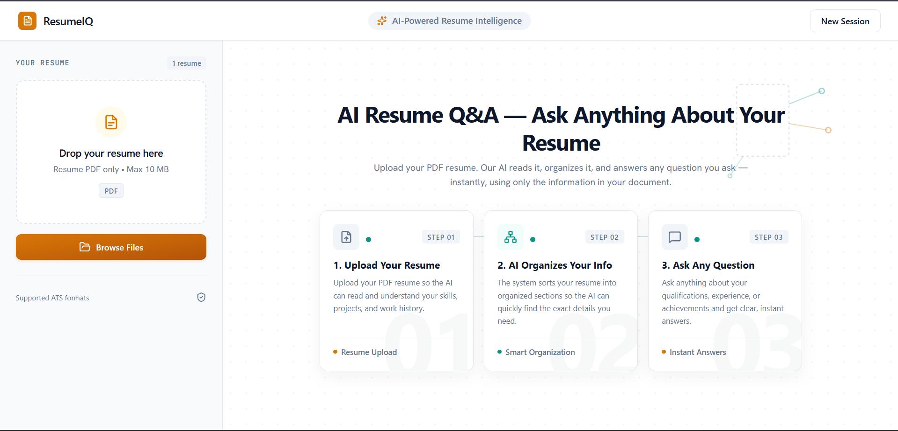
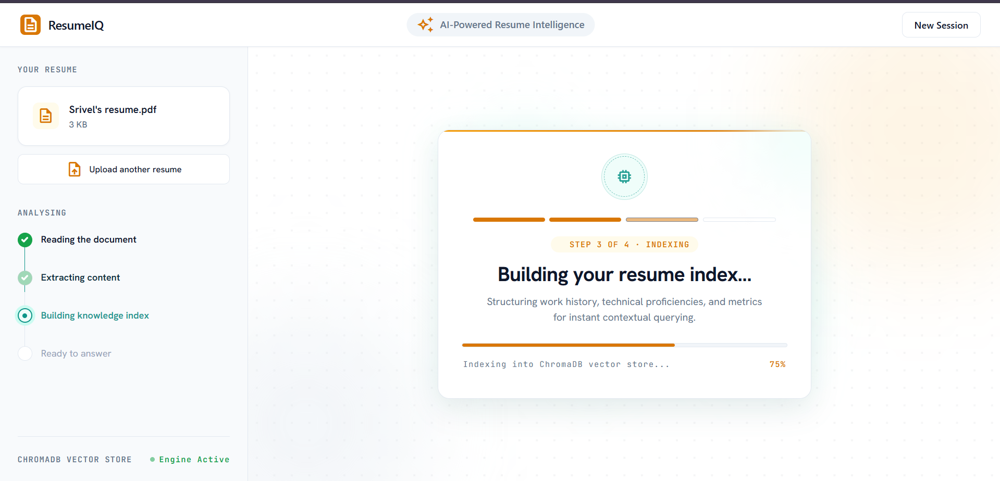
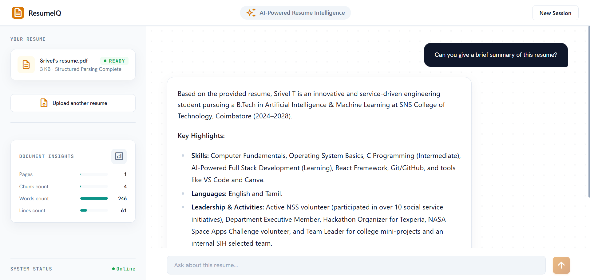

<div align="center">

# 🤖 AI Resume Analyser & Chatbot

**An intelligent full-stack platform that ingests your resume and lets you have a deep AI-powered conversation about it.**

[](https://fastapi.tiangolo.com/)
[](https://react.dev/)
[](https://vitejs.dev/)
[](https://www.typescriptlang.org/)
[](https://tailwindcss.com/)
[](https://ai.google.dev/)
[](https://www.trychroma.com/)
[](LICENSE)

**🔗 Live Demo:** `https://your-app.vercel.app` ← _add your Vercel URL here_
**🖥 Backend API:** `https://your-backend.onrender.com` ← _add your Render URL here_

</div>

---

## 📸 Screenshots

> _Add your screenshots here after deployment_

| Upload & Analyse | Indexing | AI Chat |
|:---:|:---:|:---:|
|  |  |  |

---

## ✨ Features

| Feature | Description |
|:---|:---|
| 📄 **PDF Resume Upload** | Upload any PDF resume directly from your browser. Instant server-side text extraction via PyPDF2. |
| ⚡ **Batch Embeddings** | All text chunks are embedded in a single API call using `gemini-embedding-2` for maximum speed. |
| 🧠 **RAG Chat (Retrieval-Augmented Generation)** | Your questions are embedded, semantically matched against resume chunks in ChromaDB, then answered by Gemini using only real resume content. |
| 🔄 **Multi-Key API Rotation** | Automatically rotates through up to 9 Gemini API keys if any key hits a rate limit or quota. Never lose uptime. |
| 🛡️ **Multi-Model Fallback Chain** | If one Gemini model is unavailable, the system cascades through a chain of models automatically. |
| 💬 **Limit-Aware Error Messages** | When all keys and models are exhausted (daily quota), the user sees a friendly "try again tomorrow" message — not a raw error. |
| 🗂️ **In-Memory Answer Cache** | Repeated identical questions on the same resume context return instantly from cache — zero extra API calls. |
| 📊 **Executive Resume Analysis** | Auto-extracts candidate name, competencies, experience summary, word count, token count, and page count. |
| 🎯 **Job Description Matching** | Paste a job description to get an instant percentage match score and skill gap analysis. |
| 🌟 **Premium UI** | Dark glassmorphism, smooth Framer Motion animations, responsive layout, custom Tailwind v4 design system. |

---

## 🏗️ Architecture

```
Ai_Resume_Analyser/
│
├── Backend/                         # Python FastAPI server
│   ├── main.py                      # API endpoints: /upload, /ingest_text, /search
│   ├── chunking.py                  # Splits resume text into 500-char chunks
│   ├── embedding_service.py         # Gemini batch embeddings + multi-key rotation
│   ├── rag_service.py               # Gemini answer generation + multi-model fallback + cache
│   ├── vector_store.py              # ChromaDB persistent vector store (store/search/clear)
│   ├── requirements.txt             # Python package dependencies
│   └── .env.example                 # Environment variable template
│
├── Frontend/                        # React + TypeScript + Vite
│   ├── src/
│   │   ├── App.tsx                  # Root orchestrator — state, routing, API calls
│   │   ├── types.ts                 # TypeScript type definitions
│   │   ├── vite-env.d.ts            # Vite environment variable typings
│   │   ├── index.css                # Tailwind v4 design system + custom tokens
│   │   ├── components/
│   │   │   ├── Header.tsx           # Top navigation bar
│   │   │   ├── EmptyState.tsx       # Landing / Upload resume screen
│   │   │   ├── IndexingState.tsx    # Animated indexing progress screen
│   │   │   ├── ChatState.tsx        # Main AI chat interface
│   │   │   ├── UploadModal.tsx      # PDF upload drag-and-drop modal
│   │   │   ├── JobDescriptionModal.tsx  # JD paste + match score modal
│   │   │   └── TiltCard.tsx         # 3D tilt hover card component
│   │   └── data/
│   │       └── resumes.ts           # Sample resume data & initial chat messages
│   ├── .env.example                 # Frontend environment variable template
│   ├── package.json
│   ├── tsconfig.json
│   └── vite.config.ts
│
├── .gitignore
└── README.md
```

---

## 🔄 How It Works

```
User uploads PDF
       │
       ▼
  [Backend] PyPDF2 extracts full text
       │
       ▼
  [Backend] chunking.py splits text into 500-char chunks
       │
       ▼
  [Backend] embedding_service.py → single batch call to Gemini Embedding API
       │                           (rotates API keys if quota hit)
       ▼
  [Backend] vector_store.py upserts chunks + embeddings into ChromaDB
       │
       ▼
  User asks a question in the Chat UI
       │
       ▼
  [Backend] question is embedded → ChromaDB semantic search (top 3 chunks)
       │
       ▼
  [Backend] rag_service.py sends question + relevant chunks to Gemini
       │       (rotates keys + models until one succeeds; caches result)
       ▼
  [Frontend] AI answer rendered with react-markdown + GFM formatting
```

---

## 🚀 Local Development Setup

### Prerequisites
- Python 3.10+
- Node.js 18+
- A free [Google AI Studio](https://aistudio.google.com/) API key

---

### 1. Clone the Repository

```bash
git clone https://github.com/Srivel33/Ai_Resume_Chatbot.git
cd Ai_Resume_Chatbot
```

---

### 2. Backend Setup

```bash
cd Backend

# Create and activate virtual environment
python -m venv venv

# Windows:
venv\Scripts\activate
# macOS / Linux:
source venv/bin/activate

# Install dependencies
pip install -r requirements.txt

# Create your .env file from the template
copy .env.example .env     # Windows
# cp .env.example .env     # macOS / Linux

# Open .env and paste your Gemini API key(s)
```

**Edit `Backend/.env`:**
```env
GEMINI_API_KEY_1=AIza...your_first_key
GEMINI_API_KEY_2=AIza...your_second_key   # optional backup
GEMINI_API_KEY_3=AIza...your_third_key    # optional backup
```

```bash
# Start the backend server
python -m uvicorn main:app --reload --port 8000
```

Backend runs at → **`http://localhost:8000`**  
API docs at → **`http://localhost:8000/docs`**

---

### 3. Frontend Setup

```bash
cd Frontend

# Install packages
npm install

# (Optional) Create .env for local dev — already defaults to localhost:8000
copy .env.example .env     # Windows
# cp .env.example .env     # macOS / Linux

# Start development server
npm run dev
```

Frontend runs at → **`http://localhost:5173`**

---

## 🌐 Free Tier Deployment Guide

### Step 1 — Deploy Backend on [Render.com](https://render.com) (Free)

1. Sign up at [render.com](https://render.com) and click **New → Web Service**.
2. Connect your GitHub repository.
3. Set the service configuration:

   | Setting | Value |
   |:---|:---|
   | **Root Directory** | `Backend` |
   | **Runtime** | `Python 3` |
   | **Build Command** | `pip install -r requirements.txt` |
   | **Start Command** | `uvicorn main:app --host 0.0.0.0 --port $PORT` |
   | **Instance Type** | `Free` |

4. Under **Environment Variables**, add:

   | Key | Value |
   |:---|:---|
   | `GEMINI_API_KEY_1` | `AIza...your_key_1` |
   | `GEMINI_API_KEY_2` | `AIza...your_key_2` _(optional)_ |
   | `GEMINI_API_KEY_3` | `AIza...your_key_3` _(optional)_ |

5. Deploy. Copy the URL: `https://ai-resume-backend.onrender.com`

> ⚠️ **Free tier note:** Render free instances spin down after 15 min of inactivity. The first request after idle may take ~30 seconds to wake up. This is normal behaviour on the free tier.

---

### Step 2 — Deploy Frontend on [Vercel](https://vercel.com) (Free)

1. Sign up at [vercel.com](https://vercel.com) and click **Add New → Project**.
2. Import your GitHub repository.
3. Set the project configuration:

   | Setting | Value |
   |:---|:---|
   | **Root Directory** | `Frontend` |
   | **Framework Preset** | `Vite` |
   | **Build Command** | `npm run build` |
   | **Output Directory** | `dist` |

4. Under **Environment Variables**, add:

   | Key | Value |
   |:---|:---|
   | `VITE_API_URL` | `https://ai-resume-backend.onrender.com` |

5. Click **Deploy**. Your app is live! 🎉

---

## 🔑 Environment Variables Reference

### Backend (`Backend/.env`)

| Variable | Required | Description |
|:---|:---:|:---|
| `GEMINI_API_KEY` | ✅ | Primary Gemini API key (used if no numbered keys exist) |
| `GEMINI_API_KEY_1` | ✅* | First API key — takes priority if set |
| `GEMINI_API_KEY_2` | ⭐ | Backup key for automatic quota rotation |
| `GEMINI_API_KEY_3` | ⭐ | Second backup key |

> *At least one key is required. Add multiple keys for maximum uptime.

### Frontend (`Frontend/.env`)

| Variable | Required | Description |
|:---|:---:|:---|
| `VITE_API_URL` | ⭐ | Backend base URL. Defaults to `http://localhost:8000` if not set. |

---

## 🛠️ Tech Stack

| Layer | Technology |
|:---|:---|
| **Frontend Framework** | React 19 + TypeScript |
| **Build Tool** | Vite 6 |
| **Styling** | Tailwind CSS v4 (custom design tokens) |
| **Animations** | Framer Motion (motion/react) |
| **Icons** | Lucide React |
| **Markdown Rendering** | react-markdown + remark-gfm |
| **Backend Framework** | FastAPI + Uvicorn |
| **PDF Parsing** | PyPDF2 |
| **AI / LLM** | Google Gemini (via `google-genai`) |
| **Embeddings** | Gemini `gemini-embedding-2` (batch) |
| **Vector Database** | ChromaDB (persistent local store) |
| **Environment** | python-dotenv |

---

## 📡 API Endpoints

| Method | Endpoint | Description |
|:---|:---|:---|
| `GET` | `/` | Health check — returns API status |
| `POST` | `/upload` | Upload a PDF resume file for parsing, chunking & embedding |
| `POST` | `/ingest_text` | Ingest raw text directly into the vector store |
| `POST` | `/search` | Ask a question — returns semantic search results + Gemini AI answer |

**Interactive API docs:** `http://localhost:8000/docs` (when running locally)

---

## 📄 License

MIT License — feel free to use, modify, and distribute this project.

---

<div align="center">

Made with ❤️ by [Srivel33](https://github.com/Srivel33)

⭐ **Star this repo if you found it useful!**

</div>
